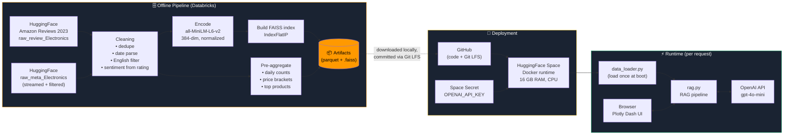
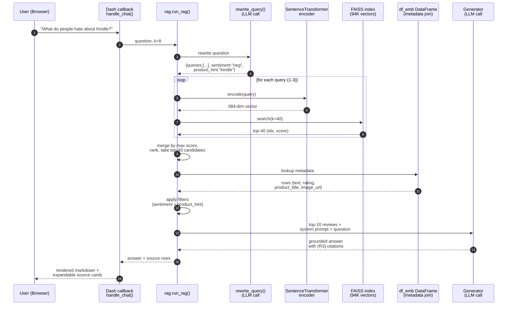
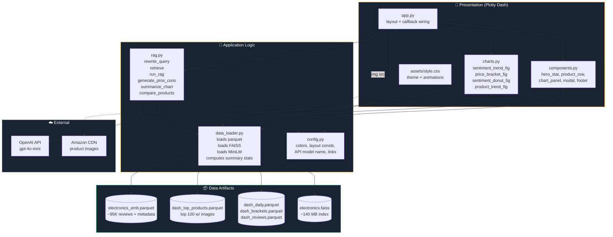

# Review Intelligence

**An AI-powered analytics dashboard over ~95,000 Amazon Electronics reviews.**
Ask natural-language questions, get grounded answers with cited sources, drill into any product, and compare two items head-to-head.

🔗 **Live demo:** [huggingface.co/spaces/ArchitBhujang/review-intelligence](https://huggingface.co/spaces/ArchitBhujang/review-intelligence)
📂 **Code:** [github.com/BhujArc24/amazon-review-intelligence](https://github.com/BhujArc24/amazon-review-intelligence)

---

## Table of Contents

1. [What this project does](#what-this-project-does)
2. [Architecture](#architecture)
3. [Tech stack](#tech-stack)
4. [Project structure](#project-structure)
5. [Step-by-step build](#step-by-step-build)
6. [Running locally](#running-locally)
7. [What I'd do differently](#what-id-do-differently)
8. [Dataset and credits](#dataset-and-credits)
9. [License](#license)
10. [Contact](#contact)

---

## What this project does

A customer-review analytics platform with four core capabilities:

- **Semantic question answering (RAG).** Ask a plain-English question. The system retrieves the most relevant reviews using vector search, then an LLM synthesizes a grounded, cited answer.
- **Pros & cons summarization.** Type any product or category. The system pulls representative positive and negative reviews and distills them into top 3 pros and top 3 cons.
- **Product deep-dive.** Click any top product to see its sentiment trend over time, AI-extracted pros/cons, and representative reviews.
- **Head-to-head comparison.** Pick two products and get an AI-generated comparison based on what reviewers actually say.

Plus a proper analytics dashboard showing sentiment trends over ~15 years, price vs. rating relationships, and top products by review volume.

---

## Architecture

The system has three runtime planes — an offline data pipeline that runs once in Databricks, a request-time RAG pipeline triggered by user interactions, and a presentation layer rendered in the browser. Below is the full component-level breakdown with the actual flow paths.

### High-level system



### Request-time RAG pipeline

When a user types a question, this is the path the request takes:



### Component map



### Key design decisions

| Decision | Why |
|---|---|
| **Streaming + filter for metadata, not bulk load** | Electronics metadata is ~1.6M rows. Bulk-loading blew out Databricks Serverless memory. Streaming with an in-flight asin filter keeps memory flat regardless of corpus size. |
| **`IndexFlatIP` (brute-force), not `IndexIVF` / `IndexHNSW`** | At ~95K vectors, brute force is sub-second. ANN indexes only pay off above ~1M vectors and add tuning complexity. |
| **Sentiment from star rating, not a sentiment model** | Star ratings are the ground truth a sentiment model would try to predict anyway. Free, deterministic, faster than running a classifier on every review. |
| **LLM-driven query rewriting before retrieval** | Raw user questions ("what do people hate about kindle") are bad embedding queries. The rewriter extracts implicit filters (sentiment, product) and generates 1–3 optimized search phrases. |
| **Multi-query retrieval, merged by max score** | One query embedding misses near-synonyms. Three queries + merge gives broader recall without the cost of a full HyDE-style approach. |
| **Pre-aggregated parquets for the dashboard** | Computing daily sentiment trends over 95K rows on every page-load would be slow. Aggregating once at build time means the dashboard renders instantly. |
| **HuggingFace Spaces over Render/Railway** | Free tier has 16 GB RAM (enough for the FAISS index + MiniLM + parquets in memory). Render's free tier (512 MB) wouldn't fit this app. |
| **Git LFS for data, not external object storage** | Single-source-of-truth in the repo. `git clone + git lfs pull` and you have everything. Trade-off: LFS bandwidth limits at scale. |

---

## Tech stack

| Layer | Tools |
|------|------|
| Data processing | Databricks (Spark / Pandas), HuggingFace `datasets` |
| Language detection | `langdetect` |
| Embeddings | `sentence-transformers` (all-MiniLM-L6-v2) |
| Vector search | FAISS (CPU, inner-product index) |
| LLM | OpenAI GPT-4o-mini (query rewriting + generation) |
| Web framework | Plotly Dash |
| Charts | Plotly |
| Styling | Vanilla CSS (no Tailwind, no component libs) |
| Deployment | Docker on HuggingFace Spaces |
| Version control | Git + Git LFS, GitHub, HuggingFace git |

---

## Project structure

```
amazon_dashboard/
├── app.py              # Layout + callbacks — the glue
├── config.py           # Colors, constants, social links
├── data_loader.py      # Loads parquets, FAISS, embedding model
├── charts.py           # Plotly figure factories
├── rag.py              # Query rewrite + retrieval + generation
├── components.py       # Reusable UI builders
├── assets/
│   └── style.css       # All styling (auto-loaded by Dash)
├── data/
│   ├── dash_daily.parquet          # Pre-aggregated daily sentiment counts
│   ├── dash_brackets.parquet       # Price bracket aggregations
│   ├── dash_top_products.parquet   # Top 100 products w/ images
│   ├── dash_reviews.parquet        # 5K sampled reviews (display)
│   ├── electronics_emb.parquet     # Reviews used for embedding
│   └── electronics.faiss           # FAISS index
├── Dockerfile          # Build config for HF Spaces
├── requirements.txt    # Python dependencies
├── .env                # OPENAI_API_KEY (gitignored)
├── .gitignore
└── .gitattributes      # Git LFS config for *.parquet / *.faiss
```

---

## Step-by-step build

What follows is the actual process, in order. If you want to reproduce or adapt it, this is the playbook.

### Phase 1 — Data ingestion

The raw Amazon dataset is massive (571 million reviews across 33 categories). I narrowed to **Electronics** and streamed the first **100,000 reviews** using HuggingFace `datasets` in streaming mode:

```python
from datasets import load_dataset
import itertools, pandas as pd

reviews = load_dataset(
    "McAuley-Lab/Amazon-Reviews-2023",
    "raw_review_Electronics",
    split="full",
    trust_remote_code=True,
    streaming=True
)
reviews_sample = list(itertools.islice(reviews, 100_000))
rdf = pd.DataFrame(reviews_sample)
```

For metadata (product titles, prices, brands, images), I used a different strategy — stream *all* product metadata but only keep rows whose `parent_asin` appears in my review sample. This keeps memory flat regardless of how big the metadata corpus is:

```python
needed = set(rdf['parent_asin'].unique())
keep = []
for row in meta:
    if row.get('parent_asin') in needed:
        keep.append({...})
mdf = pd.DataFrame(keep)
```

**Why streaming?** The Electronics metadata alone is ~1.6M products (~500 MB compressed). Loading it fully would blow out Databricks Serverless memory. Filtering during streaming keeps things tight.

### Phase 2 — Cleaning and sentiment

Standard pipeline:

1. **Dedupe** on `(user_id, parent_asin, text)`.
2. **Parse timestamps** (Unix ms → datetime).
3. **Drop empty / very short text.**
4. **English-only filter** using `langdetect`. (I tried `fasttext` first but it was incompatible with NumPy 2.x on my Databricks runtime.)
5. **Sentiment from rating** — simpler and more accurate than running a sentiment model on every review. `<=2` = negative, `>=4` = positive, `3` = neutral.
6. **Save as parquet** to persistent workspace storage. Parquet is ~10x smaller than CSV and ~50x faster to read.

Result: **94,671 clean English reviews** with full product metadata.

### Phase 3 — Embeddings and vector search

- Encoded all 94K reviews with `all-MiniLM-L6-v2` (384-dim, decent quality, fast to run).
- `normalize_embeddings=True` so I can use cosine similarity via inner product.
- Stored in a `faiss.IndexFlatIP` — the simplest FAISS index, brute-force inner-product search. Fast enough at this scale.

```python
model = SentenceTransformer('all-MiniLM-L6-v2')
embeddings = model.encode(
    texts, batch_size=128,
    normalize_embeddings=True,
    convert_to_numpy=True
).astype('float32')

index = faiss.IndexFlatIP(embeddings.shape[1])
index.add(embeddings)
faiss.write_index(index, 'data/electronics.faiss')
```

**Why `IndexFlatIP` and not `IndexIVF` or `IndexHNSW`?** At ~100K vectors, brute force is already sub-second. Approximate indexes only pay off around millions of vectors.

### Phase 4 — RAG pipeline

Plain vector search returns relevant *text*, not necessarily *good answers* to a user's question. My pipeline has four stages:

**Stage 1: Query rewriting.** The user's raw question often isn't a good embedding query. I pre-process with a small LLM call that returns structured JSON:

```json
{
  "search_queries": ["battery life", "battery drain", "charging issues"],
  "sentiment": "neg",
  "product_hint": null
}
```

This extracts the underlying intent, generates multiple query variants, and pulls out implicit filters (like "what do people hate" → `sentiment=neg`).

**Stage 2: Multi-query retrieval.** I run vector search for each of the 1–3 queries, merging results by max score. This catches reviews that match any query variant.

**Stage 3: Metadata filters.** Apply the sentiment filter and an optional product-title substring filter based on the rewriter output. If filtering would leave fewer than 3 results, I skip the filter — better to show something than nothing.

**Stage 4: Grounded generation.** The top-10 hits get packaged as context for the final LLM call, which is prompted to cite reviews inline and keep responses concrete.

### Phase 5 — Dashboard UI

Built with **Plotly Dash**, which is Python-native and let me avoid a separate frontend framework. The visual design was intentional:

- **Hero section** with animated-counter stats that count up from zero on load.
- **Sticky pill nav** at the top, highlighting sections as you scroll.
- **Scroll-reveal animations** via IntersectionObserver — every panel fades in as it enters the viewport.
- **Dark theme** with an Amazon-inspired palette: deep navy (#0F1419), orange (#FF9900), gold (#F5C518).
- **Subtle animated mesh gradient** in the background — pure CSS, no runtime cost.
- **Modals** for product drill-down and chart insights, with smooth cubic-bezier easing.
- **Product images** throughout — leaderboard thumbnails, modal heroes, comparison cards.
- **Loading states** via `dcc.Loading` so users see a spinner during RAG calls.

The whole thing is one page with sections; each section has its own callbacks wired to the relevant components. No React, no Tailwind — just Dash + vanilla CSS.

### Phase 6 — Deployment

I chose **HuggingFace Spaces with Docker** for two reasons:

1. **Free tier has 16 GB RAM** — enough to hold the FAISS index, embedding model, and parquet data all in memory at once. (Render's free tier has 512 MB, which this app wouldn't fit in.)
2. **No cold-start sleeps on active Spaces** — fast user experience after the initial build.

Data files live in the repo via **Git LFS** (~180 MB of parquet + FAISS index). The `Dockerfile` installs deps and pre-downloads the sentence-transformer model at build time, so runtime startup stays fast.

The `OPENAI_API_KEY` is stored as a Space secret (not in the repo). GitHub's push protection also saved me a couple of times when I accidentally committed `.env` — it blocked the push and forced me to rewrite history before anything leaked.

---

## Running locally

**Prerequisites:** Python 3.11+, an OpenAI API key, ~1 GB free disk.

```bash
# 1. Clone
git clone https://github.com/BhujArc24/amazon-review-intelligence.git
cd amazon-review-intelligence

# 2. Install Git LFS (needed to pull the data files)
git lfs install
git lfs pull

# 3. Create virtual env
python -m venv venv
# Windows:
venv\Scripts\activate
# Mac/Linux:
source venv/bin/activate

# 4. Install dependencies
pip install -r requirements.txt

# 5. Set your OpenAI key
echo "OPENAI_API_KEY=sk-..." > .env

# 6. Run
python app.py
```

Then open `http://127.0.0.1:8050/`. First startup takes ~30 sec while the FAISS index and embedding model load.

---

## What I'd do differently

Being honest — if I were rebuilding this:

- **Hybrid retrieval.** Pure dense retrieval misses exact keyword matches (model names, specific features). Adding BM25 and merging with reciprocal-rank fusion would improve specificity a lot.
- **Streaming LLM responses.** Right now users wait 3–5 seconds staring at a spinner. Streaming the tokens out token-by-token (via Dash's Server-Sent Events or a background callback) would feel much faster.
- **Cross-encoder reranking.** Retrieve top-50 with the bi-encoder, then rerank top-10 with a cross-encoder. Much better relevance for a small latency cost.
- **Simple response cache.** Identical queries re-run the full pipeline. Even a dict-based LRU cache on the question string would make repeat visits feel instant and cut OpenAI costs.
- **Expand to multiple categories.** The pipeline generalizes trivially — just re-run the Databricks notebook for Books, Beauty, etc. I kept it to one for scope.

---

## Dataset and credits

Data from the **Amazon Reviews 2023** dataset by the McAuley Lab at UC San Diego.

> Hou, Y., Li, J., He, Z., Yan, A., Chen, X., & McAuley, J. (2024). *Bridging Language and Items for Retrieval and Recommendation.* arXiv:2403.03952.

Dataset: [huggingface.co/datasets/McAuley-Lab/Amazon-Reviews-2023](https://huggingface.co/datasets/McAuley-Lab/Amazon-Reviews-2023)

All product images are served from Amazon's CDN via URLs included in the original dataset metadata.

---

## License

MIT — feel free to use the code, architecture, or approach for your own projects.

---

## Contact

**Archit Bhujang** · Computer Systems Engineering (Cybersecurity) @ Arizona State University

- 🔗 LinkedIn: [archit-bhujang](https://www.linkedin.com/in/archit-bhujang-840b63217/)
- 💻 GitHub: [BhujArc24](https://github.com/BhujArc24)
- ✉️ Email: [bhujang.archit@gmail.com](mailto:bhujang.archit@gmail.com)

If this helped or you're building something similar, I'd love to hear about it.